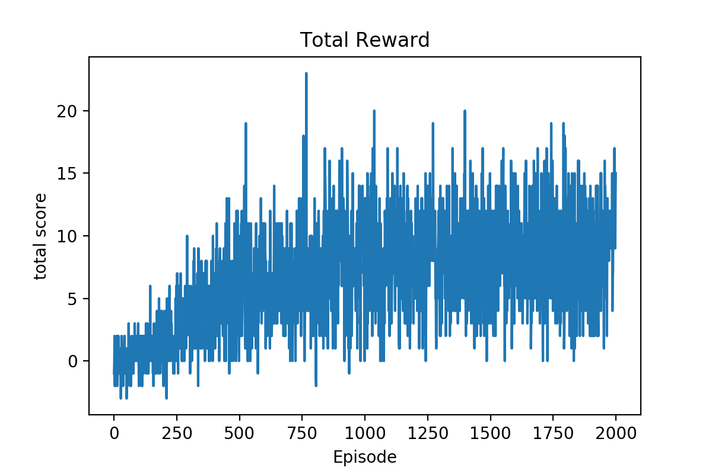

# Udacity Navigation

## 1. DQN Algorithm
DQN is off-policy reinforcement learning. And it uses replay memory.<br>Replay memory can break the correlation of samples, because the training data doesn't depend on time.<br>In NN training, DQN uses Mean Squared Error(or Huber loss) for training loss.<br>The pseduo code of DQN algorithm is below:
```pseudocode
Initialize replay memory Rep(length=N)
Initialize DQN model Q, Qtarget
Qtarget = Q

for episode:
	while episode ends:
		With probability epsilon, action = random action. or action = argmax(Q(state))
		Do action
		get next_state, reward, done
		append replay memory to (state, action, reward, next_state, done)
		get state, action, reward from replay memory and train Q
		if every update_episode:
			Qtarget = Q
```

## 2. My Implementation

### 2-1. Network Architecture
DQN network needs a NN whose input size is `(state*history) `and output size is `action space's size`.<br>So my network architecture is below:

```
Dense(37*4, ReLU)->Dense(64, ReLU)->Dense(4, Linear)
```

Using ReLU activation has two benefits:
- **No vanishing gradients problem**
- Faster calculating time

### 2-2. Hyperparameters

Below is my DQN agent's hyperparameter settings.

| Hyperparameter | Description | Value |
| :------------: | :---------: | :---: |
|  `LEARNING_RATE`  | Adam optimizer's LR  | 7e-5|
| `DISCOUNT_FACTOR` | reward discount factor | 0.99|
|`REPLAY_MEMORY_SIZE`|replay memory capacity|15000|
|`BATCH_SIZE`|batch size|64|
|`EPSILON_DECAY`|epsilon decay ratio per episode|0.9965|
|`OBSERVATION_STEP`|not training step|70|

## 3. Results

My DQN agent's reward plot is below


